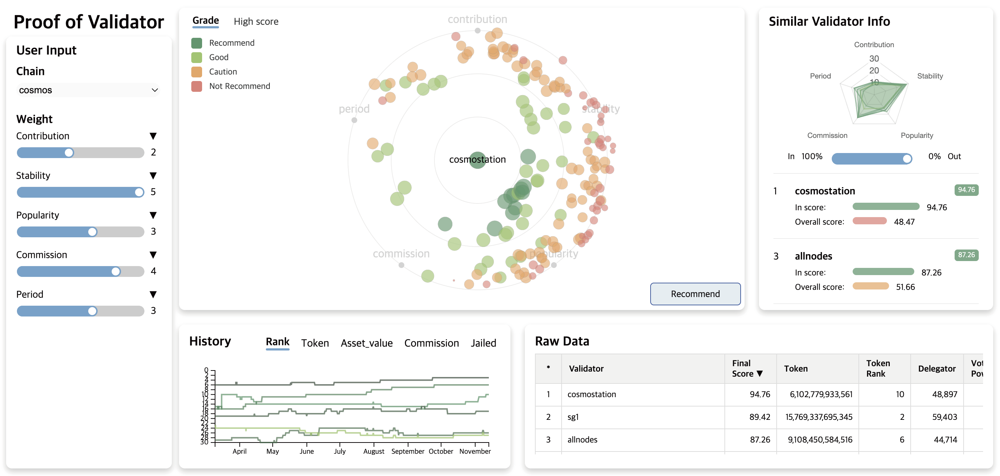

## Overview
This project presents a **Customized Validator Recommender System** designed for Proof of Stake (PoS) blockchain networks. The system enables investors to select the most appropriate validators by visualizing the relationships and scores of validators using a **similarity-based circular visualization** approach. The tool takes into account multiple evaluation metrics such as stability, profitability, and popularity, and allows investors to adjust weights based on personal preferences. The visualization provides a dynamic, intuitive way to compare validators, helping investors make informed staking decisions.
 

## Features
- **Similarity-Based Circular Visualization:** A circular layout representing validators based on their similarity scores.
- **Dynamic Assessment Metrics:** Adjustable metrics for validator evaluation, including stability, contribution, popularity, commission, and activity period.
- **Radar Charts and Line Graphs:** Complementary visualizations for in-depth comparative analysis of validators.
- **Interactive Data Exploration:** Real-time updates as users adjust scoring weights and preferences.
- **Comprehensive Validator Data:** Table views of raw validator data with sorting capabilities.

 

## **Customized Assessment Metrics**
- **Contribution**: Evaluates governance voting participation to assess validator reliability.
- **Stability:** Assesses activity consistency and missed blocks to evaluate long-term reliability.
- **Popularity:** Measures public trust based on the number of delegated tokens.
- **Commission:** Evaluates delegation fees, considering their impact on investor returns.
- **Period:** Assesses the duration of network activity, useful for long-term stability considerations.

 

## Video URL
[A Customized Validator Recommender System](https://youtu.be/T12I1t29a3I?si=UF66bmCGlQZFZiT-)